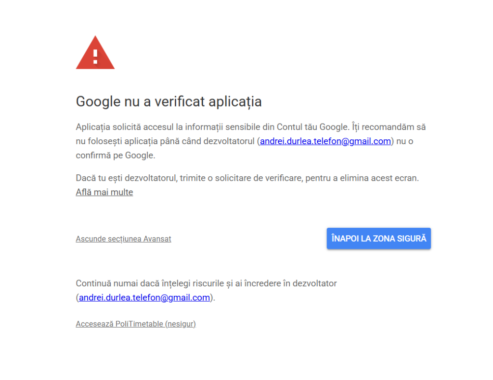

# PoliTimetable

Timetable application for Politehnica University of Bucharest.

## View a timetable
1. Select Faculty, Domain, Series etc.
2. It will load

## Make your own timetable
3. [Login with Google](https://orar.andreidurlea.com/profile)
4. Enroll to and unenroll from whichever class you want

## Get your schedule in Google Calendar 
5. Press 'Sync now'
6. If prompted to security page, click **Advanced** > **Go to PoliTimetable (unsafe)** (or **Avansat** > **Accesează PoliTimetable (nesigur)**)

## Signaling issues
To report issues, use the GitHub issues page and label them accordingly (`timetable-wrong` or `bug`).